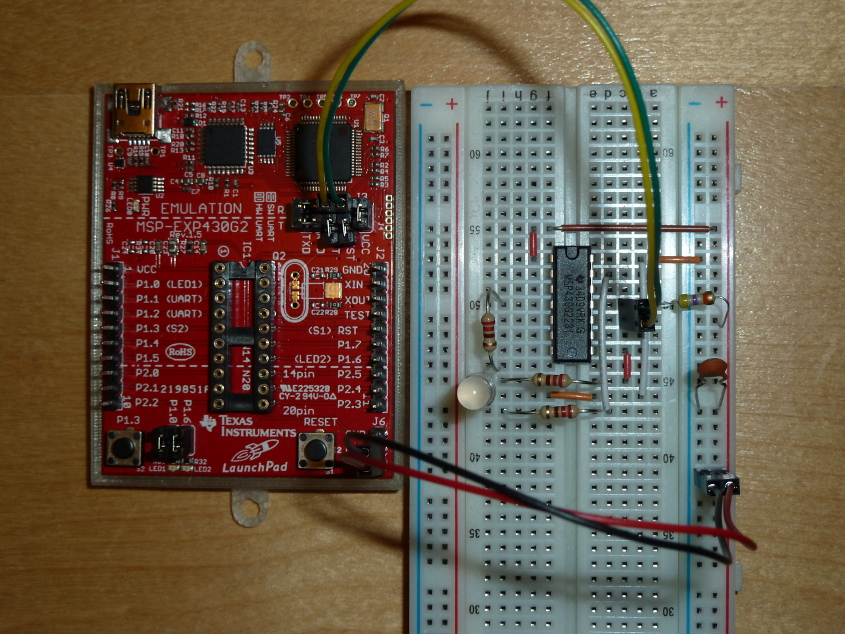
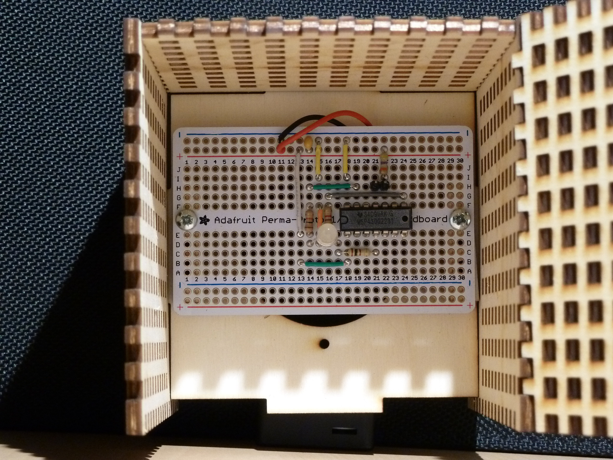

Lors du [quatrième MOOC sur les µcontrôleurs de l’EPFL](https://www.coursera.org/learn/microcontroleurs), Pierre-Yves Rochat nous a présenté comment utiliser une carte Launchpad pour programmer un MSP430 sur un breadboard. Cette façon de programmer est souvent appelée [ISP (in-system programmer) ou programmation in situ](https://fr.wikipedia.org/wiki/Programmation_in-situ) en français.

<!--
Le document original peut être téléchargé ici :
<https://pyr.ch/coursera/ExperiencesAvecLaunchpad.pdf>
-->

[Le document original au format PDF](../../files/2015-01-07-programmer_un_msp430_en_mode_ISP/ExperiencesAvecLaunchpad.pdf)

Voilà le proto sur breadboard :



Voilà le résultat final :



<figure class="half">
    
    
<!--    <figcaption>Caption describing these two images.</figcaption>
 --></figure>

## Leçons apprises

-   Programmer un MSP sur breadboard (un MSP430G2231 dans cette application).
-   Utiliser une découpeuse laser.
-   [Les plaques à souder Perma-Proto d’Adafruit](https://www.adafruit.com/blog/2011/11/18/adafruit-perma-proto-half-sized-breadboard-pcb-3-pack/) sont très pratiques.
-   Que les LED RGB translucides sont très nettement moins lumineuses que les transparentes. J’utilise une LED translucide dans ce projet, mais j’ai un gadget similaire avec une LED transparente et la différence est frappante. J’aurais aussi dû être moins conservatif sur la question de la consommation et utiliser des résistances plus faibles.
-   Qu’une LED éclaire beaucoup plus sur le dessus que sur les côtés.
-   Qu’il est horriblement long et compliqué de réaliser un projet, même aussi simple que celui-là quand on a pas de matériel. J’étais tributaire des horaires d’ouverture du FabLab Chêne 20 ~~(www.fablab-chene20.ch)~~ et ça a été la course permanente pour réaliser ce montage. Notez que j’ai réalisé deux autres versions : une qui ne sera jamais utilisée et une autre que j’ai offerte à Noël, mais qui ne contient pas le montage électronique, c’est donc un simple photophore pour y placer une bougie et il a une forme différente de celui que je présente ici.

<figure class="half">
	
	
<!-- 	<figcaption>Caption describing these two images.</figcaption>
 --></figure>

<figure class="half">
	
	
<!-- 	<figcaption>Caption describing these two images.</figcaption>
 --></figure>

## Notes

Pour ceux qui ont participé au quatrième MOOC sur les microcontrôleurs, voici le lien vers le forum où j’ai présenté ce projet :

<https://class.coursera.org/microcontroleurs-004/forum/thread?thread_id=327>

## Code

Et voilà le code pour faire des jolies transitions sur la LED RGB :

```c++
/*

    Blink Noël

    Effet “Arc-en-ciel” sur une LED RGB. Idéal pour un gadget de Noël.

    L’algorithme “Arc-en-ciel RGB” vient de :
    https://fightpc.blogspot.ch/2008/03/arduino-mood-light.html
    https://sites.google.com/site/c4rjim/blog/lampara_colores2.pde

    Version MSP430
    Implémenté sur MSP430G2231

*/


#include "Energia.h"

#define ledR P2_6
#define ledG P1_2
#define ledB P1_6
#define myDelayInit1 10
#define myDelayInit2 80
#define myDelay 1000

void customDelay( unsigned long iMax );
void setLeds( int setR, int setG, int setB );

int i;

void customDelay( unsigned long iMax )
{
    volatile unsigned long iDelay;
    for( iDelay=0; iDelay<iMax; iDelay++ ){ }
}

void setLeds( int setR, int setG, int setB )
{
    analogWrite( ledR, setR );
    analogWrite( ledG, setG );
    analogWrite( ledB, setB );
}

int main()
{
    WDTCTL = WDTPW + WDTHOLD;

    // Configuration des LED en OUTPUT et de toutes les autres I/O en INPUT
    // avec Pulldown. Pour les I/O inutilisées, TI recommande de les
    // configurer soit en OUTPUT (PxOUT est sans importance) ou en INPUT avec
    // Pullup/Pulldown (voir https://www.ti.com/lit/ug/slau144j/slau144j.pdf).
    // Comme le µcontrôleur sera moulé dans de la colle, si des impuretés
    // viennent à faire baisser la résistance, la solution INPUT/Pulldown
    // paraît plus sûre qu’OUTPUT ou INPUT/Pullup.

    // ledR, ledG, ledB -> OUTPUT
    // Toutes les autres -> INPUT

    //         l   l
    //         e   e
    //         d   d
    //         B   G
    P1DIR = 0b01000100;

    //         l
    //         e
    //         d
    //         R
    P2DIR = 0b01000000;

    // ledR, ledG, ledB -> pas de Pullup/Pulldown
    // Toutes les autres -> Pullup/Pulldown
    P1REN = 0b11111111 ^ P1DIR;
    P2REN = 0b11111111 ^ P2DIR;

    // ledR, ledG, ledB -> OUTPUT = 0
    // Toutes les autres -> Pulldown
    P1OUT = 0b00000000;
    P2OUT = 0b00000000;

    for( i = 0; i < 256; i++ ){ setLeds( i,   0,     0     ); customDelay( myDelayInit1 ); }
    for( i = 0; i < 256; i++ ){ setLeds( 255, i,     0     ); customDelay( myDelayInit2 ); }
    for( i = 0; i < 256; i++ ){ setLeds( 255, 255,   i     ); customDelay( myDelayInit2 ); }
    for( i = 0; i < 256; i++ ){ setLeds( 255, 255-i, 255   ); customDelay( myDelayInit2 ); }
    for( i = 0; i < 256; i++ ){ setLeds( 255, 0,     255-i ); customDelay( myDelayInit2 ); }


    while( true )
    {
        for( i = 0; i < 256; i++ ){ setLeds( 255,   i,     0     ); customDelay( myDelay ); }
        for( i = 0; i < 256; i++ ){ setLeds( 255-i, 255,   0     ); customDelay( myDelay ); }
        for( i = 0; i < 256; i++ ){ setLeds( 0,     255,   i     ); customDelay( myDelay ); }
        for( i = 0; i < 256; i++ ){ setLeds( 0,     255-i, 255   ); customDelay( myDelay ); }
        for( i = 0; i < 256; i++ ){ setLeds( i,     0,     255   ); customDelay( myDelay ); }
        for( i = 0; i < 256; i++ ){ setLeds( 255,   0,     255-i ); customDelay( myDelay ); }
    }
}
```
