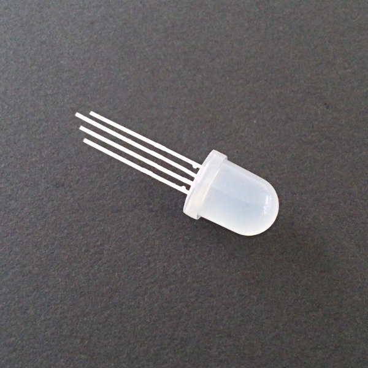
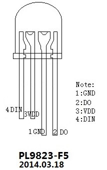
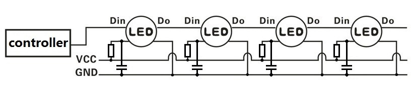
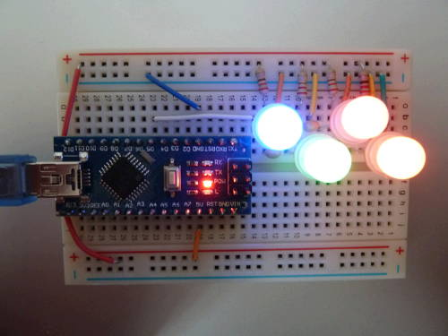
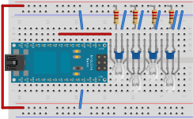

Pour mon [projet de programmation d’un MSP430 en mode ISP](/blog/programmer_un_msp430_en_mode_ISP/), j’ai utilisé une LED RGB. C’est simplement trois LED dans un seul boîtier avec quatre pattes : une pour chaque couleur et une pour la masse.

Jusque là, rien de bien méchant. Mais comme je n’avais qu’une LED de ce type et que je l’ai soudée sur mon [Perma-Proto d’Adafruit](https://www.adafruit.com/blog/2011/11/18/adafruit-perma-proto-half-sized-breadboard-pcb-3-pack/), il m’en fallait des nouvelles. Ni une, ni deux, j’ai commandé quatre [LED P9823-F8](https://shop.boxtec.ch/led-neopixel-8mm-p9823-p-42265.html) chez Boxtec.

{:height="250px" width="250px"}

Mal m’en a pris, elles ne sont pas du tout du même type que ma LED RGB de base. En fait ce sont des LED adressables en PWM. Eh oui, elles contiennent de la logique capable de comprendre un signal PWM et de s’allumer en conséquence. Avec en plus la possibilité d’être mises en série.

D’après Boxtec, la [LED P9823-F8](https://shop.boxtec.ch/led-neopixel-8mm-p9823-p-42265.html) est compatible avec [le modèle WS2812 vendu par Adafruit](https://www.adafruit.com/datasheets/WS2812.pdf).

Pour la programmation sur Arduino, j’ai trouvé deux librairies :

-   [NeoPixels d’Adafruit](https://github.com/adafruit/Adafruit_NeoPixel)
-   [FastLED](https://fastled.io)

Celle d’Adafruit est plus simple à mettre en œuvre et les exemples fonctionnent bien.

## Pinout

{:width="200px"}

## Câblage

{:width="600px"}

### Notes

-   Sur mon câblage, on voit que j’ai mis la pin DO de la dernière LED à la masse. Ce n’est pas nécessaire.
-   Les résistances sont de 220 Ω (à remplacer par des 47 Ω ou des 10 Ω !!)
-   Les condensateurs sont des 104 (100 nF)

## Exemple de programme

[P9823_LED_RS232.ino](../../files/2015-05-22-leds_adressables/P9823_LED_RS232.ino)

## Liens

-   [Spécification (en chinois traduit en anglais par Google...)](https://shop.boxtec.ch/pub/diverse/P9823.pdf)
-   [Boxtec NeoPixel Guide](https://playground.boxtec.ch/doku.php/led/ledpixel_guide)

## Problème

Le rouge ne fonctionne pas bien. Avec une LED c’est OK, mais dès qu’on en utilise plus, elles ont tendance à clignoter. Ceci est probablement dû au fait que les LED rouges ont besoin de plus de courant pour bien fonctionner. J’ai donc fait un test (2 mois plus tard...) avec des résistances de 47 Ω à la place des 220 Ω et ça fonctionne nettement mieux ! Pour avoir du blanc presque blanc, je suis descendu jusqu’à 10 Ω. Bon le mieux est de vérifier la tension aux bornes des pattes d’alimentation des LED. Voilà ce que j’obtiens avec différentes résistances :

    R LED (Ω)   U LED (V)
    =====================
       10         3.5
       47         3.0
      220         2.5

Donc, même avec 10 Ω, la tension n’atteint pas les 4.5 V minimums de la spec. Heureusement, ça marche quand même. Bon, le Vcc du µcontrôleur se casse la gueule assez vite, donc inutile de vouloir lui coller trop de LED...
