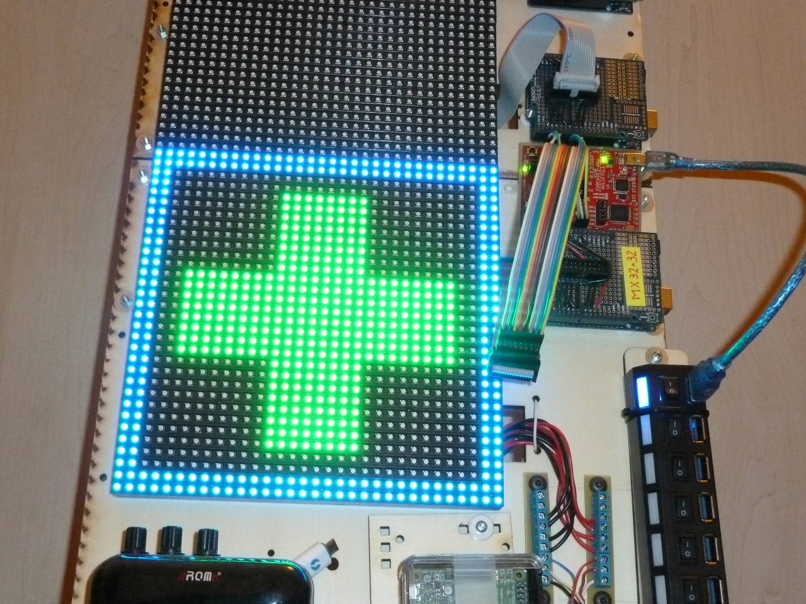
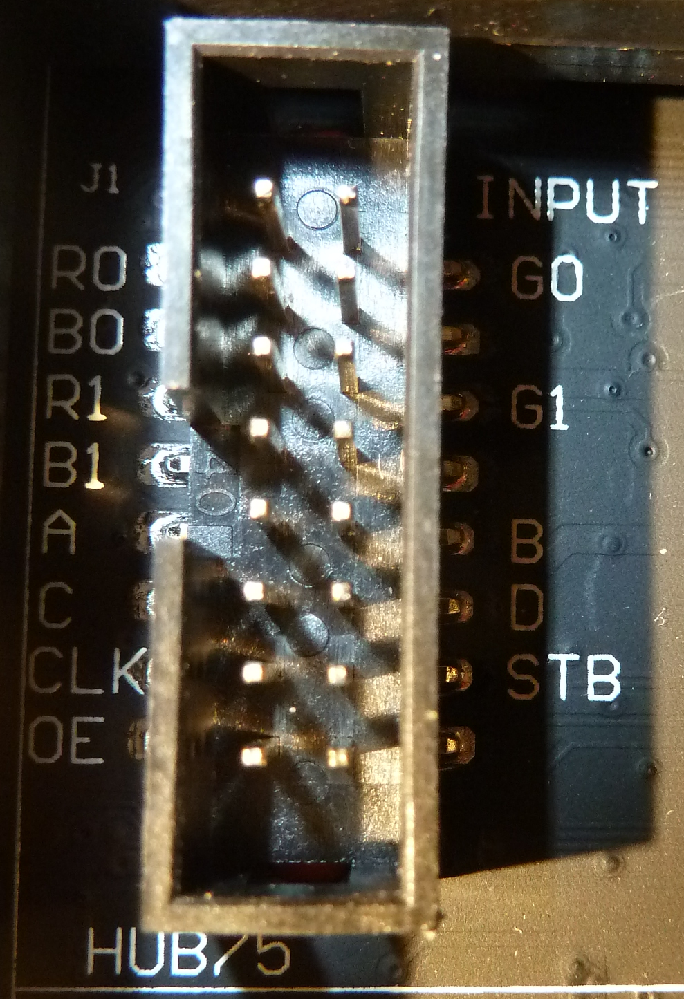
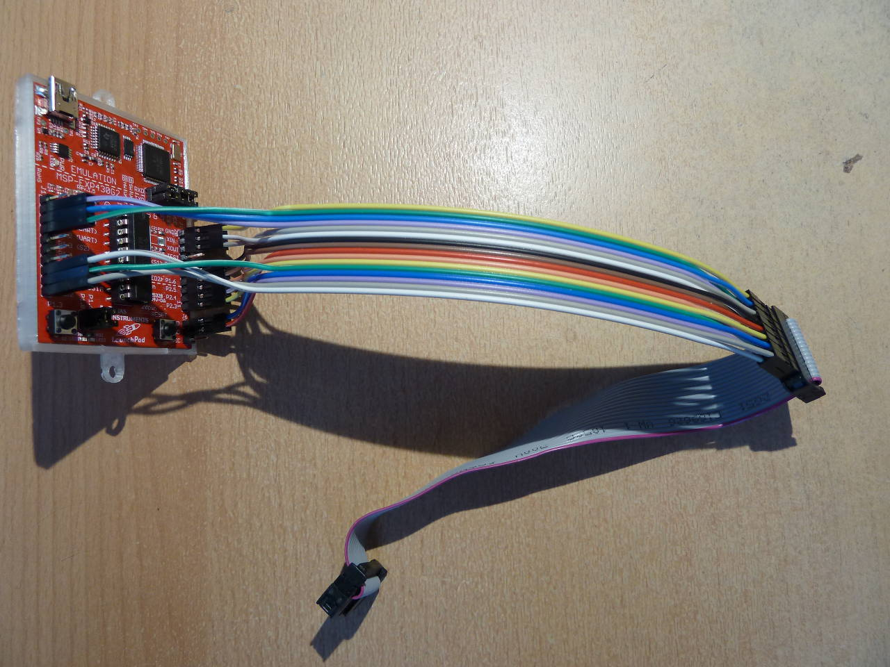

## Référence de la matrice sur AliExpress

<https://fr.aliexpress.com/item/1677389664.html>

## Launchpad

Launchpad-MSP430 rev 1.5, voir le brochage ici : <https://ouilogique.com/blog/pinouts/index.html#pinout-launchpad-msp430>

## Brochage

Le brochage est décrit au début du programme ci-dessous.

[Image du connecteur sur Adafruit.com](https://learn.adafruit.com/system/assets/assets/000/023/769/original/led_matrix_socket3.png?1426305755){:target="\_blank"}

{:height="438px" width="300px"}



## Article sur Adafruit

<https://learn.adafruit.com/32x16-32x32-rgb-led-matrix?view=all>

## Brochage des différents connecteurs de matrices

~~www.ec086.com/Technical_support.html~~

## Programme

Le programme ci-dessous m’a été gracieusement transmis par [Pierre-Yves Rochat](mailto:pyr@pyr.ch). La seule chose que j’ai modifiée est la description du brochage pour qu’elle corresponde à ma matrice. Voir l’article d’Adafruit ci-dessus au sujet des différentes descriptions de brochage.

&nbsp;

```c++
// Brochage de la matrice (HUB75)

//     (P2.0) |  R0 [ 1]         [ 2] G0  | (P2.2)
//     (P2.4) |  B0 [ 3]         [ 4]     | (GND)
//     (P2.1) |  R1 [ 5]         [ 6] G1  | (P2.3)
//     (P2.5) |  B1 [ 7]         [ 8]     | (GND)
//     (P1.6) |   A [ 9]         [10] B   | (P1.7)
//      (XIN) |   C [11]         [12] D   | (XOUT)
//     (P1.1) | CLK [13]         [14] STB | (P1.2)
//     (P1.3) |  OE [15]         [16]     | (GND)


// Afficheur 32 x 32 RGB
// Utilisation en monochrome, 1 bit par couleur par pixel
//-------------------------------------------------------
// Exemple : lancer de drapeau...
// (2015) Pierre-Yves Rochat, pyr@pyr.ch

// Définitions matérielles :
//==========================


// Données des couleurs :
#define R1On P2OUT |= (1<<0)
#define R1Off P2OUT &=~(1<<0)
#define G1On P2OUT |= (1<<2)
#define G1Off P2OUT &=~(1<<2)
#define B1On P2OUT |= (1<<4)
#define B1Off P2OUT &=~(1<<4)

#define R2On P2OUT |= (1<<1)
#define R2Off P2OUT &=~(1<<1)
#define G2On P2OUT |= (1<<3)
#define G2Off P2OUT &=~(1<<3)
#define B2On P2OUT |= (1<<5)
#define B2Off P2OUT &=~(1<<5)

// Données des lignes :
#define AOn P1OUT |= (1<<6)
#define AOff P1OUT &=~(1<<6)
#define BOn P1OUT |= (1<<7)
#define BOff P1OUT &=~(1<<7)
#define COn P2OUT |= (1<<6)
#define COff P2OUT &=~(1<<6)
#define DOn P2OUT |= (1<<7)
#define DOff P2OUT &=~(1<<7)

// Signaux de contrôle :
#define ClockHaut P1OUT |= (1<<1)
#define ClockBas P1OUT &=~(1<<1)

#define LatchHaut P1OUT |= (1<<2)
#define LatchBas P1OUT &=~(1<<2)

#define OeHaut P1OUT |= (1<<3)
#define OeBas P1OUT &=~(1<<3)

void SetABCD(uint16_t ligne) {
  if (ligne&1) AOn; else AOff;
  if (ligne&2) BOn; else BOff;
  if (ligne&4) COn; else COff;
  if (ligne&8) DOn; else DOff;
}

// Définition d'une matrice de 32 lignes de 32 points, 3 couleurs :
#define MAX_X 32
#define MAX_Y 32
#define TAILLE_MOT 16
#define LG_MATRICE_1COUL MAX_X * MAX_Y / TAILLE_MOT
#define NB_COUL 3 // Rouge-Vert-Bleu
#define LG_MATRICE LG_MATRICE_1COUL * NB_COUL
uint16_t Matrice [LG_MATRICE];

// Routine de balayage :
//----------------------
void BalayeMatrice(uint16_t nbScan) {
  uint16_t b, i, rouge, vert, bleu, n;
  uint32_t masque;
  for (n=0; n<nbScan; n++) {
    for (i=0; i<LG_MATRICE_1COUL/2; i++) {
      SetABCD(i>>1);
      masque = 1;
      for (b=0; b<TAILLE_MOT; b++) {
        rouge = i; vert = i + LG_MATRICE_1COUL;  bleu = vert + LG_MATRICE_1COUL;
        if (Matrice[rouge] & masque) R1On; else R1Off;
        if (Matrice[vert] & masque) G1On; else G1Off;
        if (Matrice[bleu] & masque) B1On; else B1Off;

        if (Matrice[rouge + ((MAX_Y / 2) * MAX_X / TAILLE_MOT)] & masque) R2On; else R2Off;
        if (Matrice[vert + ((MAX_Y / 2) * MAX_X / TAILLE_MOT)] & masque) G2On; else G2Off;
        if (Matrice[bleu + ((MAX_Y / 2) * MAX_X / TAILLE_MOT)] & masque) B2On; else B2Off;
        ClockHaut;
        masque = masque << 1;
        ClockBas;
      }
      if (i & 1) {
        LatchBas; LatchHaut;
        OeBas;
        delayMicroseconds(200);
        OeHaut;
        // delayMicroseconds(100);
      }
    }
  }
}

#define NOIR 0
#define ROUGE 1
#define VERT 2
#define BLEU 4
#define BLANC ROUGE+VERT+BLEU

uint16_t couleur; // Variable globale pour la couleur

// Adaptation de la géométrie :
//-----------------------------
uint16_t CalculeIndex(int16_t x, int16_t y) {
  uint16_t index;
  // permutation des y2 et y3 :
  uint16_t yy = y;
  if (y & (1<<2)) yy |= (1<<3); else yy&=~(1<<3);
  if (y & (1<<3)) yy |= (1<<2); else yy&=~(1<<2);

  index = (yy<<1) | (x>>4); // 5 bits : y4 y3 y2 y1 y0 x4
  return index;
}

uint16_t CalculeNoBit(int16_t x, int16_t y) {
  uint16_t noBit;
  noBit = x & 0xF; // 4 bits : x4 x3 x2 x1 x0
  return noBit;
}

void AllumePoint(int16_t x, int16_t y) {
  // tient compte de la variable globale couleur
  uint16_t index = CalculeIndex(x, y);
  uint16_t noBit = CalculeNoBit(x, y);
  if ((x>=0) && (x<MAX_X) && (y>=0) && (y<MAX_Y)){
    if (couleur & ROUGE) {
      Matrice[index] |= (1<<noBit);
    } else {
      Matrice[index] &=~(1<<noBit);
    }
    if (couleur & VERT) {
      Matrice[index + LG_MATRICE_1COUL] |= (1<<noBit);
    } else {
      Matrice[index + LG_MATRICE_1COUL] &=~(1<<noBit);
    }
    if (couleur & BLEU) {
      Matrice[index + (LG_MATRICE_1COUL * 2)] |= (1<<noBit);
    } else {
       Matrice[index + (LG_MATRICE_1COUL * 2)] &=~(1<<noBit);
    }
  }
}

// Primitives de dessin :
//-----------------------
void EteintPoint(int16_t x, int16_t y) {
  uint16_t coul = couleur;
  couleur = NOIR;
  AllumePoint(x, y);
  couleur = coul;
}

void EffaceMatrice() { // met tous les points à 0
  int16_t x, y;
  for (y=0; y<MAX_Y; y++) {
    for (x=0; x<MAX_X; x++) {
      EteintPoint(x, y);
    }
  }
}

void DroiteHorizontale (int16_t x, int16_t y, int16_t lg) {
  uint16_t i;
  for (i=0; i<lg; i++) {
    AllumePoint (x+i, y);
  }
}

void DroiteVerticale (int16_t x, int16_t y, int16_t lg) {
  uint16_t i;
  for (i=0; i<lg; i++) {
    AllumePoint (x, y+i);
  }
}

// Interpréteur de commandes graphiques :
//=======================================

#define DrH 0x30 // + dx (sur 4 bits) : droite horizontale, depuis le curseur courant
#define DrV 0x40 // + dy (sur 4 bits) : droite verticale, depuis le curseur courant
#define PlusX 0x50 // + dx (sur 4 bits) : avance le curseur en X
#define PlusY 0x60 // + dy (sur 4 bits) : avance le curseur en Y
#define MoinsX 0x70 // + dx (sur 4 bits) : recule le cureur en X
#define MoinsY 0x80 // + y (sur 4 bits) : recule le curseur en Y
#define Repete 0x90 // + 4 bits : préfixe de répétition pour l'instruction suivante (souvent un call)
#define Delai 0xA0 // + 4 bits : Attente, valeur exposant de 2
#define SetAccu 0xB0 // + 4 bits : Charge l'accumulateur (utilisé pour Couleur, à compléter)
#define Label 0xC0 // + 5 bits (32 routines max)
#define Call 0xE0 // + 5 bits

#define Fin 0 // fin du programme
#define Vide 1 // efface l'écran
#define Ret 2 // retour de sous-routine (saut à l'adresse sur la pile)
#define Origine 3 // place le curseur à 0,0
#define ZeroX 4 // met à zéro X
#define Couleur 5 // détermine la couleur, selon la valeur de l'accumulateur
#define Masque 0x9
#define InvMasque 0xA // inverse le masque courant
#define SetDelai 0xB // définit du délai utilisé entre l'affichage de chaque point dses droites
#define SetDelaiDef 0xC // définit la valeur du délai 0
#define Effet 0xD
#define Libre2 0xE // instructions non utilisées
#define Libre1 0xF

// Label des routines :
#define Croix7x7 1
#define Croix7x7plusDel 2
#define Croix7x7passeX 3
#define Croix7x7Tourne 4
#define CadreCroix23 5
#define CadreCroix4 15
#define CadreCroix5 6
#define CroixGrandit 7
#define CadreEtCroix 16
#define DroitesArrivent 13
#define CadreSimpleCarre 14
#define Caducee 8
#define CadreTrait 20
#define CadreTraitX4 18
#define DroiteHori 9
#define DroiteVert2P 10
#define DroitesHoriDescendent 11
#define DroitesVertDeGauche 12
#define TeteFleche 21
#define LangueSerpent 19
#define CadreTrait3 22
#define CadreTourneVite 23

// Programme :
const uint16_t Prog [] = {
  Label+Croix7x7, // Affiche une croix 7x7 (1/4 de la surface), curseur courant
  PlusX+2,
  DrH+2, PlusY+1, MoinsX+2,
  DrH+2, PlusY+1, MoinsX+4,
  DrH+6, PlusY+1, MoinsX+6,
  DrH+6, PlusY+1, MoinsX+6,
  DrH+6, PlusY+1, MoinsX+4,
  DrH+2, PlusY+1, MoinsX+2,
  DrH+2, MoinsY+6, MoinsX+4,
  Ret,

  Label+Croix7x7plusDel, // Afficheur une croix 7x7, déplace le curseur en X et attend 2
  Vide, Call+Croix7x7, PlusX+1, Delai+2, Ret,

  Label+Croix7x7passeX, // Fait passer une croix X
  ZeroX, MoinsX+8, Repete+12, Call+Croix7x7plusDel,
  Repete+12, Call+Croix7x7plusDel, Vide, Delai+6, PlusY+2, Ret,

  Label+Croix7x7Tourne, // Fait tourner une croix 7x7 au 4 coins du carré
  Origine, Call+Croix7x7, Delai+6,
  PlusX+9, Call+Croix7x7, Delai+6,
  PlusY+9, Call+Croix7x7, Delai+6,
  MoinsX+9, Call+Croix7x7, Delai+7,
  SetAccu+BLEU, Couleur,
  Origine,
  Call+Croix7x7, Delai+6,
  PlusX+9, Call+Croix7x7, Delai+6,
  PlusY+9, Call+Croix7x7, Delai+6,
  MoinsX+9, Call+Croix7x7, Delai+7,
  SetAccu+VERT, Couleur,
  Ret,

  Label+CadreCroix23, // Cadre de croix, largeur 2 et 3
  Origine, PlusX+7, PlusY+3, DrV+9, MoinsY+9, PlusX+1, DrV+9,
  MoinsY+5, MoinsX+5, DrH+9, MoinsX+9, PlusY+1, DrH+9, Delai+6,
  Origine, PlusX+6, PlusY+2, DrV+11, DrH+3, MoinsY+11, DrV+11, MoinsX+3, MoinsY+11, DrH+3,
  Origine, PlusY+6, PlusX+2, DrH+11, DrV+3, MoinsX+11, DrH+11, MoinsY+3, MoinsX+11, DrV+3, Delai+6,
  Ret,

  Label+CadreCroix4, // Cadre de croix, largeur 4
  Origine, PlusX+5, PlusY+1, DrV+13, DrH+5, MoinsY+13, DrV+13, MoinsX+5, MoinsY+13, DrH+5,
  Origine, PlusY+5, PlusX+1, DrH+13, DrV+5, MoinsX+13, DrH+13, MoinsY+5, MoinsX+13, DrV+5, Delai+6,
  Ret,

  Label+CadreCroix5, // Cadre de croix, largeur 5
  Origine, PlusX+4, DrV+15, DrH+7, MoinsY+15, DrV+15, MoinsX+7, MoinsY+15, DrH+7,
  Origine, PlusY+4, DrH+15, DrV+7, MoinsX+15, DrH+15, MoinsY+7, MoinsX+15, DrV+7, Delai+7,
  Ret,

  Label+CroixGrandit, // Croix grandit
  Call+CadreCroix23, Call+15, Call+6, SetAccu+ROUGE, Couleur, Call+CadreCroix23, Call+15, Delai+8,
  SetAccu+VERT, Couleur, Vide, Delai+6,
  Ret,

  Label+LangueSerpent, // langue du serpent
  SetAccu+NOIR, Couleur, DrH+0, SetAccu+VERT, Delai+6, Couleur, DrH+0, Ret,

  Label+Caducee, // caducée
  Origine, PlusY+4, PlusX+2, DrH+11,
  PlusY+1, MoinsX+9, DrH+7,
  PlusY+1, MoinsX+5, DrH+3,
  PlusY+8, MoinsX+3, DrH+3,
  PlusY+1, MoinsX+5, DrH+7,
  MoinsY+8, MoinsX+4, DrV+6,
  MoinsY+6, PlusX+1, DrV+6,
   Delai+6, SetAccu+BLEU, Couleur, SetAccu+3, SetDelai,
  PlusX+2, PlusY+1, DrH+0, MoinsY+1, DrH+0, MoinsY+1, MoinsX+1, DrH+0, Delai+4,
  MoinsY+1, MoinsX+3, DrH+0, MoinsY+1, MoinsX+1, DrH+0,
  MoinsY+1, DrH+0, MoinsY+1, PlusX+1, DrH+0, Delai+4,
  PlusX+3, DrH+1,
   MoinsY+1, PlusX+1, DrH+0, MoinsY+1, DrH+0, Delai+4,
  MoinsY+3, DrH+0, MoinsY+1, MoinsX+1, DrH+0,
  MoinsY+1, MoinsX+1, DrH+0, MoinsX+1, DrH+0, MoinsX+1, DrH+0,
  SetAccu+0, SetDelai, MoinsX+2, DrH+1, MoinsX+1, PlusY+1, DrH+1,
  SetAccu+6, SetDelai, MoinsX+2, PlusY+1, DrH+0,
  Repete+5, Call+LangueSerpent, // langue
  SetAccu+0, SetDelai, Vide, Delai+6,
  Ret,

  Label+DroiteHori, // droite horizontale
  SetAccu+NOIR, Couleur, DrH+15, MoinsX+15, PlusY+1,
  SetAccu+VERT, Couleur, DrH+15, MoinsX+15, Delai+1,
  Ret,

  Label+DroiteVert2P, // droite verticale (en 2 parties)
  SetAccu+NOIR, Couleur, DrV+4, PlusY+7, DrV+4, MoinsY+15, PlusX+1,
  SetAccu+VERT, Couleur, DrV+4, PlusY+7, DrV+4, MoinsY+15, Delai+1,
  Ret,

  Label+DroitesHoriDescendent, // droites horizontales qui descendent
  Repete+8, Call+DroiteHori, MoinsY+9, Ret,

  Label+DroitesVertDeGauche, // droites verticales qui viennent de la gauche
  Repete+8, Call+DroiteVert2P, MoinsX+9, Ret,

  Label+DroitesArrivent, // Croix composée par des droites qui arrivent
  Origine, PlusY+2,
  Repete+6, Call+DroitesHoriDescendent,
  Origine, PlusX+2,
  Repete+6, Call+DroitesVertDeGauche, Delai+8, SetAccu+ROUGE, Couleur,
  Call+CadreCroix23, SetAccu+VERT, Couleur, Delai+8, Vide, Ret,

  Label+CadreSimpleCarre, // Cadre simple du carré
  Origine, DrH+15, DrV+15,
  Origine, DrV+15, DrH+15,
  Ret,

  Label+CadreEtCroix, // cadre et croix
  SetAccu+1, SetDelai, Call+CadreCroix23, Call+CadreSimpleCarre, Delai+8,
  SetAccu+BLEU, Couleur, Call+CadreSimpleCarre, Delai+8, SetAccu+VERT, Couleur,
  Vide,
  Ret,

  Label+CadreTraitX4, // Cadre traitillé x4
  SetAccu+1, Masque, Call+CadreTrait, Call+CadreTrait, Call+CadreTrait, Call+CadreTrait, Ret,

  Label+CadreTrait, // Cadre traitillé
  Origine, DrH+15,
  InvMasque, DrV+15,
  Origine, InvMasque, DrV+15,
  InvMasque, DrH+15,
  Delai+5,
  Ret,

  // à terminer...
  Label+TeteFleche, // tête de flèche et avance
  SetAccu+VERT, Couleur, DrV+8, DrH+8, MoinsX+9, MoinsY+7, Delai+6,
  DrV+8, DrH+8, MoinsX+9, MoinsY+7,
  SetAccu+NOIR, Couleur, PlusX+3, MoinsY+3,  DrV+4, PlusY+4, PlusX+4, DrH+4, MoinsX+10, MoinsY+8,
  Delai+7,
  Ret,

  Label+CadreTrait3,
  Origine, SetAccu+3, Masque, DrH+15, DrV+15, SetAccu+4, Masque, Origine, DrV+15, DrH+15, Delai,
  Origine, SetAccu+4, Masque, DrH+15, DrV+15, SetAccu+3, Masque, Origine, DrV+15, DrH+15, Delai,
  Origine, SetAccu+5, Masque, DrH+15, DrV+15, SetAccu+5, Masque, Origine, DrV+15, DrH+15, Delai,
  SetAccu+0, Masque,
  Ret,

  Label+CadreTourneVite,
  Repete+15, Call+CadreTrait3,
  Ret,

  // programme principal :
  Vide,
  Repete+4, Call+CroixGrandit, // Croix grandit
  Vide, Repete+4, Call+Croix7x7Tourne, Vide, // 4 croix tournent
  Repete+3, Call+CadreEtCroix, Vide, Delai+7, SetAccu+0, SetDelai, // Cadre et croix
  Origine, Repete+5, Call+Croix7x7passeX, // Croix passe
  // Call+CadreCroix23, SetAccu+2, SetDelaiDef, Repete+8, Call+CadreTourneVite, Vide, Delai+7,
  Origine, Repete+3, Call+DroitesArrivent, Delai+7, Vide, Delai+6, // Droites qui arrivent
  Repete+3, Call+Caducee,  Vide, Delai+6,  // caducée
  // Call+CadreCroix23, Repete+15, Call+CadreTraitX4, Vide, Delai+6, SetAccu+0, Masque,
  // Vide, Origine, PlusX+8, Repete+7, Call+TeteFleche, Delai+7, Vide, Delai+8,
  Fin
};

const uint16_t TableDelais[] = {
  1, 2, 3, 5, 9, 15, 25, 40, 70, 120, 180, 255
};

// Accès par les coordonnées X et Y :
// Variables globales, pour gagner de la place...
int DelaiPoint; // attente entre chaque point dessiné
unsigned int MasquePoints; // masque de dessin
unsigned int PointeurMasque;
unsigned int X, Y;

void SetXyMasque () {
  AllumePoint(X*2, Y*2); AllumePoint(X*2+1, Y*2);
  AllumePoint(X*2, Y*2+1); AllumePoint(X*2+1, Y*2+1);
}


int Pile [10]; // stack pour l'adresse de retour et le comptage courant

void Interprete () { // version avec plusieurs switch, selon la longueur de l'op-code
  int pc; // compteur de programme
  int sp; // pointeur de pile (qui monte)
  pc=0; sp=0;
  unsigned int Accu = 0; // accumulateur, pour le passage des valeurs
  unsigned int DelaiDef = 0; //délai par défaut (valeur 0)
  unsigned char instr; // instruction en cours
  unsigned char instr04, instr05; // paramètres (4 et 5 bits à droite)
  int nb = 1; // compteur des répétitions
  int i; // pour les droites
  MasquePoints = 0xFFFF; // pas de masque actif
  while (Prog[pc]!=Fin) {
    instr = Prog[pc]; // lecture de l'instruction
    PointeurMasque = 1; // (pour les droites seulement, mais ne gène pas ici)
    instr05 = instr & 0x1F; // paramètre sur 5 bits
    instr04 = instr & 0x0F; // paramètres sur 4 bits
    switch (instr) { // décodage des instructions sans paramètres
      case Vide : EffaceMatrice(); break;
      case Ret : pc = Pile[--sp];  nb = Pile[--sp]; break;
      case Origine : Y = 0;  // X = 0; break; astuce : pas de break
      case ZeroX : X = 0; break;
      case Couleur : couleur = Accu & 7; break; // Couleur sur 3 bits
      case Masque :
        if (Accu==0) { MasquePoints = 0xFFFF; }
        if (Accu==1) { MasquePoints = 0x5555; }
        if (Accu==2) { MasquePoints = 0xAAAA; }
        if (Accu==3) { MasquePoints = 0xB6DB; } // 1011 0110 1101 1011
        if (Accu==4) { MasquePoints = 0xDB6D; } // 1101 1011 0110 1101
        if (Accu==5) { MasquePoints = 0x6DB6; } // 0110 1101 1011 0110
        if (Accu==6) { MasquePoints = 0x0000; }
        break;
      case InvMasque : MasquePoints = ~MasquePoints; break; // 0xB6DB; break; // 101
      case SetDelai : DelaiPoint = (1 << Accu) & (~1); break;
      case SetDelaiDef : DelaiDef = Accu; break;
      case Effet : break; // pas implémenté
      default : break;
    }

    // Décodage des  instructions avec des paramètres de 4 bits
    // et 5 bits (double "case") (gagne 4 octets...)
    switch (instr & 0xF0) { // 4 bits de poids fort
      case Label :
      case Label + 0x10 :
        do {
          pc++;
        } while ((Prog[pc]!=Fin) && (Prog[pc]!=Ret));
        break;
      case Call :
      case Call + 0x10 :
        Pile [sp++] = nb;
        Pile [sp++] = pc;
        pc = 0; // recherche depuis le début
        while (Prog[pc] != (Label | instr05)) {
          pc++;
        }
        nb = 1;
        break;
      case DrH :  // PointeurMasque = 1; // au début
            for(i=0; i<(instr04+1); i++){ // droite horizontale
              SetXyMasque(); X++;
            }
            X--; break;
      case DrV :  // PointeurMasque = 1;
            for(i=0; i<(instr04+1); i++){ // droite verticale
              SetXyMasque(); Y++;
            }
            Y--; break;
      case PlusX : X+=instr04; break;
      case PlusY : Y+=instr04; break;
      case MoinsX : X-=instr04; break;
      case MoinsY : Y-=instr04; break;
      case Repete : nb=instr04+1; pc++; break;
      case Delai :
        if (instr04==0) { instr04 = DelaiDef; } // valeur par défaut
        BalayeMatrice(TableDelais[instr04]); break;
      case SetAccu : Accu = instr04; break;
      default : break;
    }
    if (nb==1) { pc++; } else { nb--; }
  }
}

// Programme principal :
//======================

void setup() { // Initialisations :
  P1DIR = 0xFF; P2DIR = 0xFF; // tous les ports en sortie
  P1OUT = 0; P2OUT = 0; // toutes les sorties à 0
  EffaceMatrice(); // met tous les points à 0
  couleur = VERT;
}

void loop() { // Boucle de l'animation
  Interprete();
}
```
