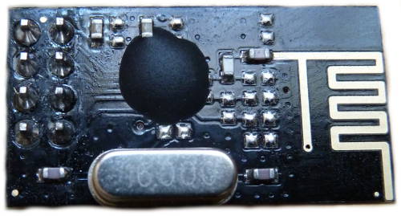
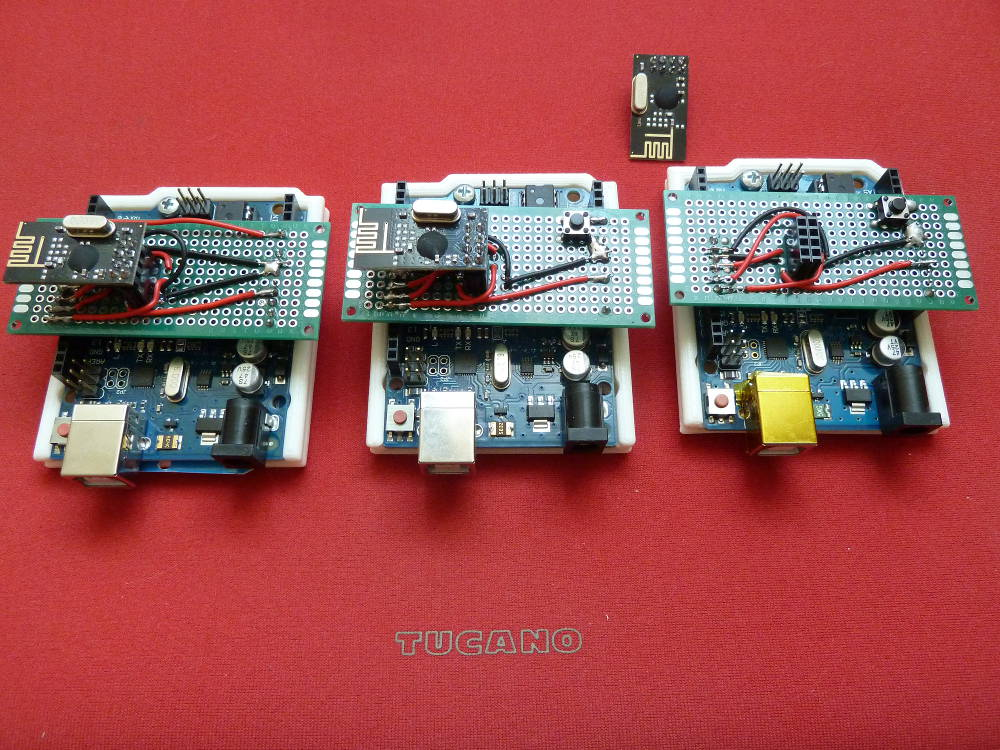
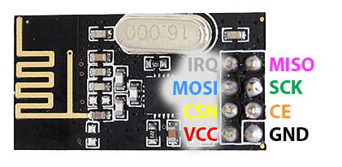
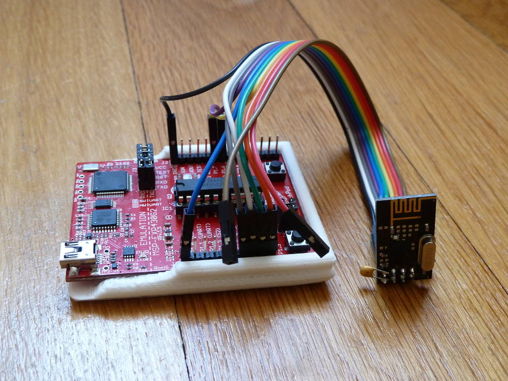

## Matériel

Les modules présentés sur les photos de cet article ont l’antenne intégrée au PCB. C’est bien pour faire des tests à moindre coût ou si les modules doivent communiquer dans la même pièce. Pour des applications plus robustes, je conseille de choisir un modèle avec antenne.

**Modèle avec antenne PCB**
<https://www.banggood.com/10Pcs-NRF24L01-SI24R1-2_4G-Wireless-Power-Enhanced-Communication-Receiver-Module-p-1059602.html?p=0431091025639201412F>

**Modèle avec antenne externe**
<https://fr.aliexpress.com/item/2pcs-lot-Special-promotions-1100-meter-long-distance-NRF24L01-PA-LNA-wireless-modules-with-antenna/32246689488.html>

## Caractéristiques techniques

Le module nRF24L01+ est un émetteur-récepteur (= transceiver) RF 2.4 GHz à très basse consommation et très faible coût qui convient particulièrement bien pour les applications DIY. Il fonctionne avec une tension d’alimentation de 3.3 V, mais ses signaux sont tolérants au 5 V et il peut donc être utilisé avec un Arduino Uno par exemple.

[Comparé au ZigBee, le nRF24L01+ est moins performant, propose moins de fonctionnalités, mais il est beaucoup moins cher.](https://tmrh20.github.io/RF24Network/Zigbee.html) Il permet de créer des réseaux en étoile et en arbre.

### Résumé des caractéristiques

-   Fréquence : 2.4 GHz ISM (Industrial, Scientific and Medical) band
-   Tension d’alimentation : 1.9 à 3.6 V
-   Interface SPI jusqu’à 10 Mb/s (tolérant 5 V)
-   Vitesses de transmission : 250 kb/s¹, 1 Mb/s et 2 Mb/s
-   Très basse consommation (plusieurs mois, voire années avec une pile bouton ou des piles AA/AAA). 900 nA deep sleep mode. 13.3 mA Radio RX at 2 Mb/s on-air data-rate.
-   Peut être utilisé avec des microcontrôleurs très basiques comme l’ATtiny
-   [Prix inférieur à 1$](http://fr.aliexpress.com/item/10PCS-NRF24L01-Wireless-Transceiver-Module-2-4GHz-For-AVR-ARM-Arduino-MCU/658370933.html)
-   Portée : quelques mètres avec une antenne PCB (modèle présenté ici) et jusqu’à un kilomètre avec une antenne externe (et beaucoup de chance).
-   [Protocole propriétaire _Enhanced ShockBurst™_](https://devzone.nordicsemi.com/documentation/nrf51/4.3.0/html/group__esb__users__guide.html) qui permet la communication bidirectionnelle avec mise en mémoire tampon des paquets de données, confirmation des paquets reçus et retransmission automatique des paquets perdus.

<small>¹ Modèle nRF24L01+ uniquement</small>

### Spécifications techniques de Nordic Semiconductor

-   [nRF24L01][1]
-   [nRF24L01+](http://www.nordicsemi.com/eng/Products/2.4GHz-RF/nRF24L01P)

### Note

Préférer le modèle _nRF24L01+_ au modèle _nRF24L01_ (sans le +). Pour savoir quel est le type d’un module, utiliser [le programme d’exemple `pingpair_ack.ino`](https://github.com/TMRh20/RF24/blob/master/examples/pingpair_ack/pingpair_ack.ino), ou le programme `printDetails.ino` ci-dessous. Une des différences notables est la possibilité de descendre à 250 kb/s pour le modèle +. En plus de ça, Nordic indique dans la spec du *nRF24L01+* : _Intermodulation and wideband blocking values in nRF24L01+ are much improved in comparison to the nRF24L01 and the addition of internal filtering to nRF24L01+ has improved the margins for meeting RF regulatory standards._

```c++
// printDetails.ino
// Permet de différencier un nRF24L01 d’un nRF24L01+

#include <SPI.h>
#include "nRF24L01.h"
#include "RF24.h"
#include "printf.h"

RF24 radio( 9, 10 );

void setup()
{
  Serial.begin( 115200 );
  printf_begin();
  radio.begin();
  radio.printDetails();
}

void loop(){}
```



_D’après le programme `printDetails.ino`, [ce module acheté chez AliExpress est un nRF24L01+](http://fr.aliexpress.com/item/10PCS-NRF24L01-Wireless-Transceiver-Module-2-4GHz-For-AVR-ARM-Arduino-MCU/658370933.html)._


_Le bouton sur les shields est connecté à la broche `A0`. Le brochage du nRF24 est disponible dans le tableau ci-dessous._
_Il faut connecter un condensateur électrolytique de 3.3 µF à 10 µF en parallèle sur l’alim (pas visible sur l’image)._



## Brochage

Pour les brochages de l’ATtiny et du RPi, voir <https://tmrh20.github.io/RF24/>.

| Broche | nRF24L01+ | Arduino UNO | Launchpad MSP430 |
| :----- | :-------- | :---------- | :--------------- |
| 1      | GND       | GND ¹       | GND              |
| 2      | VCC       | 3.3V ¹      | VCC              |
| 3      | CE        | 9 ²         | P2.0             |
| 4      | CSN       | 10 ²        | P2.1             |
| 5      | SCK       | 13          | P1.5             |
| 6      | MOSI      | 11          | P1.7             |
| 7      | MISO      | 12          | P1.6             |
| 8      | IRQ       | -           | P2.2             |

¹ Ajouter un condensateur électrolytique de 3.3 µF à 10 µF en parallèle sur l’alim.
² Les broches pour `CE` et `CSN`, peuvent être configurée logiciellement lors de l’initialisation du RF24 avec l’instruction `RF24 radio(9,10);`. Par défaut, TMRh20 utilise les broches 7 et 8 (`RF24 radio(7,8);`). Il faut donc modifier les exemples en fonction du choix de brochage.

## Description des signaux

> Voir les pages 11 et 50 de la spec [nRF24L01][1]

| Signal | Direction | Description                                                                                                                |
| :----- | :-------- | :------------------------------------------------------------------------------------------------------------------------- |
| `CE`   | input     | _Chip Enable_<br/>Ce signal est actif à 1 et sert à configurer le module en mode de réception (RX) ou de transmission (TX) |
| `CSN`  | input     | _SPI Chip Select_                                                                                                          |
| `SCK`  | input     | _SPI Clock_                                                                                                                |
| `MOSI` | input     | _SPI Slave Data Input_                                                                                                     |
| `MISO` | output    | _SPI Slave Data Output, with tri-state option_                                                                             |
| `IRQ`  | output    | _Maskable interrupt pin_<br/>Ce signal est actif à 0 et contrôlé par trois sources d’interruption masquables               |

## nRF24L01+ dans l’IDE Arduino

L’IDE Arduino v.1.6.9 propose d’installer 4 bibliothèques nRF24 écrites par TMRh20. Pour les installer avec l’IDE, aller dans `Croquis/Inclure une bibliothèque/Gérer les bibliothèques`, chercher `nRF24` et installer les 4 bibliothèques de _TMRh20_.

J’indique également les liens directs vers ces bibliothèques ci-dessous. Elles comprennent de nombreux exemples et c’est par là qu’il faut commencer. Elles sont optimisées pour Arduino et pour Raspberry Pi.

[À noter que TMRh20 propose d’autres bibliothèques pour le nRF24L01+ sur son compte GitHub](https://github.com/TMRh20?tab=repositories).

Ça vaut aussi la peine de lire [cette page sur le blog de TMRh20](http://tmrh20.blogspot.ch/2014/03/high-speed-data-transfers-and-wireless.html)

-   [GitHub — RF24](https://github.com/TMRh20/RF24)
-   [GitHub — RF24Network](https://github.com/TMRh20/RF24Network)
-   [GitHub — RF24Mesh](https://github.com/TMRh20/RF24Mesh)
-   [GitHub — RF24Ethernet](https://github.com/TMRh20/RF24Ethernet)

## Liens

### Maniacbug

Maniacbug a un très bon tuto sur le nRF24. Les bibliothèques de TMRh20 sont un fork de celles de Maniacbug.

-   [Maniacbug — Tuto nRF24](https://maniacbug.wordpress.com/2011/11/02/getting-started-rf24/)
-   [Maniacbug — Bibliothèque nRF24](https://github.com/maniacbug?tab=repositories)

### Radiohead

La bibliothèque _Radiohead_ de Mike McCauley permet de communiquer via une quantité impressionnante de protocoles différents, y compris le nRF24.

-   [Page d’accueil de la bibliothèque Radiohead](http://www.airspayce.com/mikem/arduino/RadioHead/)
-   [Radiohead — nRF24](http://www.airspayce.com/mikem/arduino/RadioHead/classRH__NRF24.html)

### Autres

mysensors.org propose plein de recettes pour utiliser le RF24

-   <https://www.mysensors.org>

Et sur cet autre blog, l’auteur décrit tous les problèmes qu’il a rencontrés. Il insiste beaucoup sur le condensateur à connecter à l’alimentation.

-   <http://arduino-info.wikispaces.com/Nrf24L01-2.4GHz-HowTo>

## nRF24L01+ sur Launchpad MSP430

J’ai fait un test rapide sur Launchpad MSP430 et ça fonctionne.

-   [Launchpad MSP430 — Bibliothèque nRF24](https://github.com/spirilis/msprf24)
-   [Launchpad MSP430 — Tuto nRF24](https://battomicro.wordpress.com/2013/03/27/tutorial-le-nrf24l01-larduino-et-le-msp-430/)



_On ne voit qu’un Launchpad sur la photo, mais pour les tests, j’en ai préparé deux identiques._

## nRF24L01+ sur ESP8266

Ça marche aussi sur l’ESP8266 12-E et sur le WEMOS V2.

J’ai testé avec deux configurations différentes pour le brochage de `CSN`. Ça fonctionne dans les deux cas, il suffit d’adapter le code en conséquence :

`RF24 radio( CE, CSN );`
par exemple :
`RF24 radio( 0, 2 );`
ou
`RF24 radio( 0, 15 );`

| nRF24L01+ | ESP8266 12-E                |
| :-------- | :-------------------------- |
| VCC       | VCC                         |
| GND       | GND                         |
| CSN       | GPIO 2 (D4) ou GPIO 15 (D8) |
| CE        | GPIO 0 (D3)                 |
| MOSI      | HMOSI (D7)                  |
| SCK       | HSCLK (D5)                  |
| IRQ       | —                           |
| MISO      | HMISO (D6)                  |

Voir aussi le [brochage de l’ESP8266 12-E](../pinouts/#pinout-carte-avec-firmware-nodemcu-et-module-wifi-esp8266--amica)

### Liens pour l’ESP8266

-   <https://www.mysensors.org/build/esp8266_gateway>
-   <https://github.com/TMRh20/RF24/issues/125>

[1]: http://www.nordicsemi.com/eng/Products/2.4GHz-RF/nRF24L01
