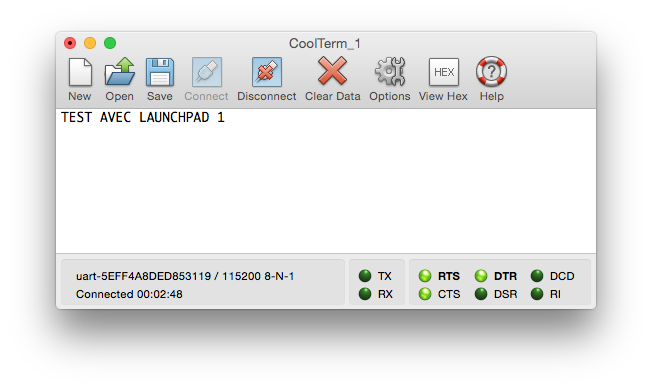
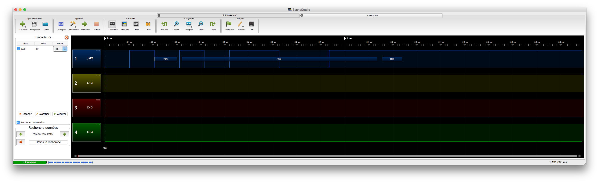
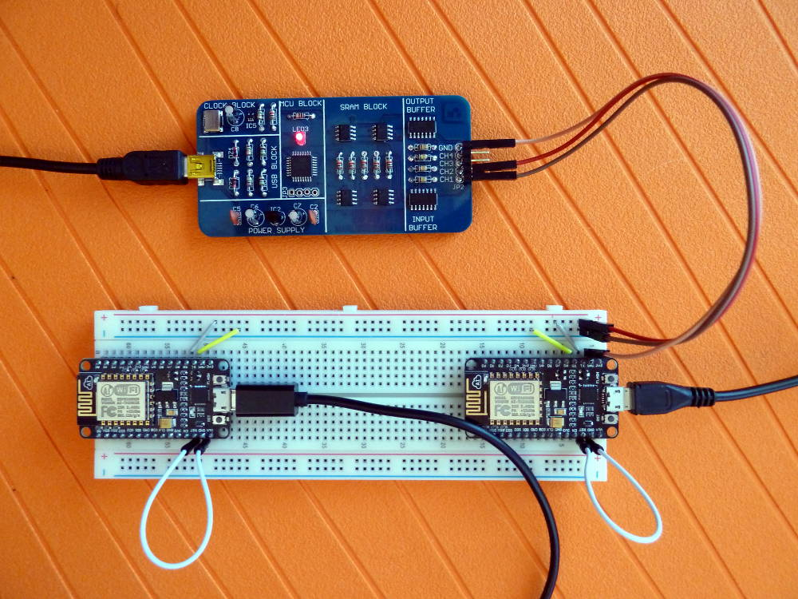

L’idée est de déterminer s’il est possible de remplacer un bridge USB-RS232 ([UART][2]) par une carte à microcontrôleur comme le Launchpad, l’Arduino Nano ou l’ESP8266. Elle m’a été inspirée par [cette réponse sur StackExchange][0].

## Essai avec Launchpad

### Programmation des Launchpad

```c++
/*
  serial_end.ino

  Ce programme arrête la gestion du port série par le
  microcontrôleur. Contrairement à ce que suggère la
  documentation¹, cela permet d’envoyer RX et TX depuis l’USB vers
  les pins correspondantes sans pertes. Si on n’arrête pas
  le port série, il se peut que des caractères ne soient pas
  transmis, mais ce comportement n’est pas reproductible et ce
  programme permet de rendre le comportement fiable.

  ¹ https://www.arduino.cc/en/Serial/End
*/

void setup()
  { Serial.end(); }
void loop()
  {}
```

### Branchements

-   Deux Launchpad avec RX connecté à TX et inversement TX à RX.
-   GND connecté à GND.
-   Les cavaliers RXD et TXD connectés horizontalement (mode `HW UART` selon le pictogramme à côté des cavaliers).


### Résultats

On peut envoyer des commandes d’un Launchpad vers l’autre via [CoolTerm][1]. Malheureusement, même si on modifie la vitesse de transmission dans CoolTerm, elle reste à 9600 bauds entre les deux Launchpad. J’ai vérifié ça avec un analyseur logique.






### Sans le microcontrôleur

Et ça fonctionne aussi sans le microcontrôleur.


[0]: http://arduino.stackexchange.com/questions/18575/send-at-commands-to-esp8266-from-arduino-uno-via-a-softwareserial-port/18614#18614
[1]: http://freeware.the-meiers.org/
[2]: https://fr.wikipedia.org/wiki/UART

---

## Essai avec ESP8266-12E — Test 1

### Programmation des ESP8266-12E

Idem que pour les Launchpad (programme serial_end.ino)

### Branchements

-   Deux ESP8266-12E avec RX connecté à TX et inversement TX à RX.


### Résultats

On peut envoyer des commandes d’un ESP8266-12E vers l’autre via [CoolTerm][1]. Contrairement aux Launchpad, on peut modifier la vitesse de transmission dans CoolTerm et la vitesse de transmission entre les deux ESP8266-12E change aussi. Encore une fois j’ai vérifié ça avec un analyseur logique.

#### 9600 bauds


#### 115200 bauds


---

## Essai avec ESP8266-12E — Test 2

La différence entre le test 2 et le test 1, c’est que j’ai connecté la broche RST au GND. Pour vérifier que les ESP ne démarrent pas, j’ai chargé le programme blink.ino.

### Programmation des ESP8266-12E

[Avec blink.ino](https://github.com/NicHub/ouilogique-ESP8266-Arduino/blob/master/blink/blink.ino)

### Branchements

-   Deux ESP8266-12E avec RX connecté à TX et inversement TX à RX.
-   RST connecté à GND



### Résultats

Idem que pour le test 1.
