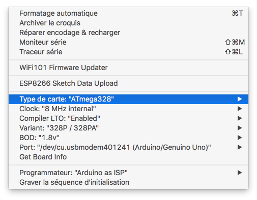
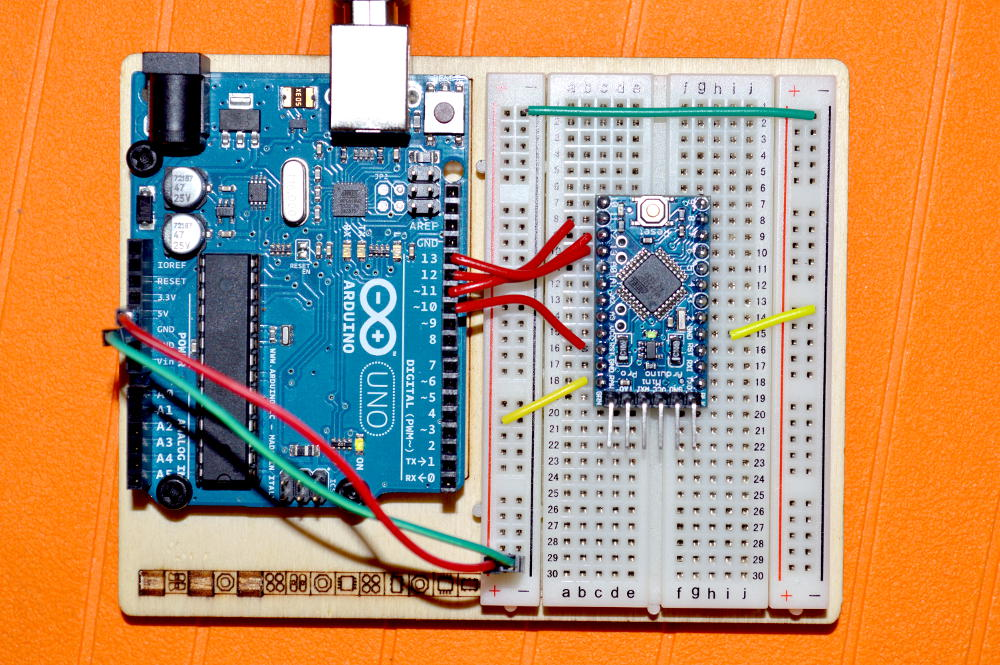

[ATmega328P-AU Pro Mini 3.3V 8MHz (oscillateur interne ⇒ pas de quartz), acheté chez Banggood pour 13 $ les 5 pièces][1]

La définition des fusibles dans l’IDE 1.6.12 pour `Arduino Pro or Pro Mini` a un problème et l’IDE renvoie l’erreur suivante quand on veut graver un nouveau bootloader :


 ***failed;
avrdude: WARNING: invalid value for unused bits in fuse "efuse", should be set to 1 according to datasheet
This behaviour is deprecated and will result in an error in future version
You probably want to use 0xfd instead of 0x05 (double check with your datasheet first).


Donc, je mes suis rabattu sur MiniCore : <https://github.com/MCUdude/MiniCore>, d’après la suggestion trouvée à <http://arduino.stackexchange.com/a/31199/13995>.

La procédure d’utilisation est très bien détaillée sur la page GitHub de MiniCore, donc je ne la répète pas ici.

La configuration que j’ai utilisée est la suivante :

La programmation ISP fonctionne nickel, mais je n’arrive pas à [utiliser l’ESP8266 comme bridge USB‑RS232](http://ouilogique.com/usb-rs232_bridge_microcontroleurs/).

⚠ Comme j’ai Arduino Pro Mini 3.3 V, j’ai connecté le 5 V du UNO sur l’entrée RAW du Pro Mini.

### Brochage

| UNO | Pro Mini |
| :-: | :-:      |
| 5V  | RAW  ⚠   |
| GND | GND      |
| 10  | RST      |
| 11  | 11       |
| 12  | 12       |
| 13  | 13       |

[1]: http://www.banggood.com/5Pcs-3_3V-8MHz-ATmega328P-AU-Pro-Mini-Microcontroller-Board-For-Arduino-p-980292.html?p=0431091025639201412F

