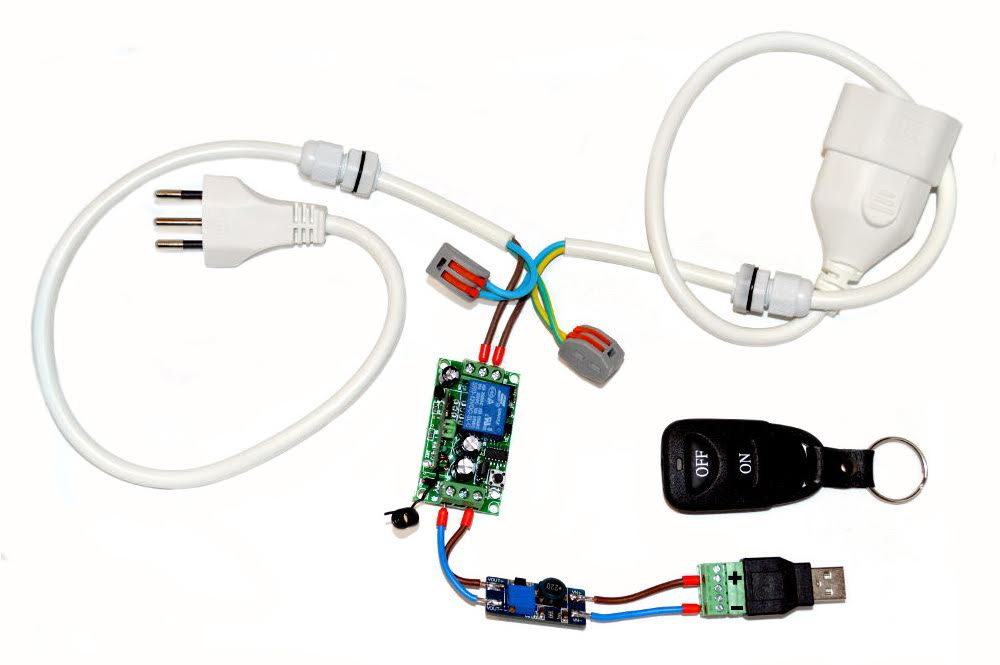

## Matériel

-   [DC-12V-10A-Relay-1CH-Wireless-RF-Remote-Control-Switch-Transmitter-Receiver][1]
-   [USB-male-to-screw-connector-USB][2]
-   [Wago 2 broches][3]
-   [Booster 2A 2V-24V][5]

[1]: http://www.banggood.com/DC-12V-10A-Relay-1CH-Wireless-RF-Remote-Control-Switch-Transmitter-Receiver-p-1040721.html?p=0431091025639201412F
[2]: https://fr.aliexpress.com/item/5Pcs-free-shipping-USB-male-to-screw-connector-USB-plug-with-shield-connector-USB-Adapter-USB2/32705960671.html
[3]: https://fr.aliexpress.com/item/Free-shipping-WAGO-222-412-Universal-Compact-2-Wire-Wiring-Connector-2-pin-Conductor-Terminal-Block/32275638715.html
[4]: https://fr.aliexpress.com/item/10-Pcs-PCT-218-8-Pin-Universal-compact-wire-wiring-connector-conductor-terminal-block-with-lever/32666933106.html
[5]: http://www.banggood.com/10-Pcs-Step-Up-Power-Spply-Module-2A-2V-24V-DC-DC-Booster-Power-Module-p-1064479.html
