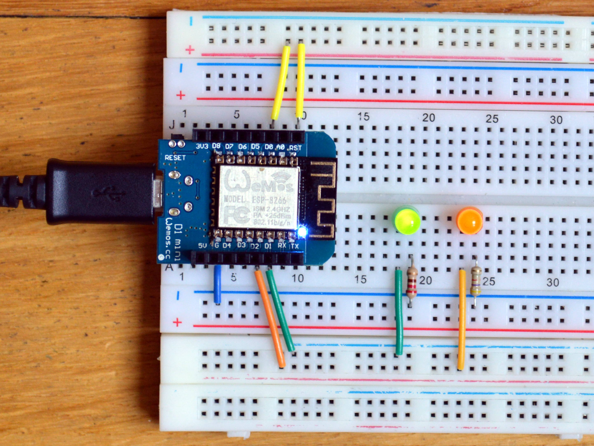
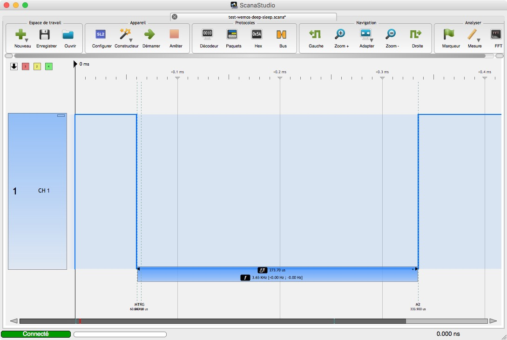

## Matériel

- [WeMos® D1 Mini V2 NodeMcu 4M Bytes Lua WIFI Internet Of Things Development Board Based ESP8266][1]

[1]: http://www.banggood.com/WeMos-D1-Mini-V2-NodeMcu-4M-Bytes-Lua-WIFI-Internet-Of-Things-Development-Board-Based-ESP8266-p-1115398.html?p=0431091025639201412F

## Montage 1 — Interruption temporelle

L’ESP sort du *deep sleep* à intervales réguliers. Lors de ce reset, D0 passe à `0` pendant 273.70 µs et doit être connecté à `RST`. Le `reset` a lieu lors du flanc montant.

*Note : 273.70 µs correspond à 21896 cycles d’horloge à 80 MHz (= 80E+6 \* 273.7E-6).*

## Montage 2 — Interruption externe

L’ESP sort du *deep sleep* lorsque le bouton connecté en *pull-up* est pressé. Problème garanti avec ce montage parce que l’ESP sera *reseté* autant de fois que le bouton sera pressé, y compris lors des rebonds du bouton. Une solution serait d’utiliser une bascule en entrée (<https://github.com/esp8266/Arduino/issues/1488>).

## Programme de test

Note : c’est le même programme qui est utilisé pour les deux montages.



/*

Test Deep Sleep Wemos

avril 2017, ouilogique.com

*/

#include <ESP8266WiFi.h>
extern "C" {
#include "user_interface.h"
}

static const uint8_t LEDverte  = D1; // GPIO 5
static const uint8_t LEDorange = D2; // GPIO 4
static const uint8_t LEDbleue  = D4; // GPIO 2 ⇒ LED du board

#define LEDverteHIGH  digitalWrite( LEDverte, HIGH )
#define LEDverteLOW   digitalWrite( LEDverte, LOW )
#define LEDorangeHIGH digitalWrite( LEDorange, HIGH )
#define LEDorangeLOW  digitalWrite( LEDorange, LOW )
#define LEDbleueHIGH  digitalWrite( LEDbleue, LOW )   // LED du board ⇒ logique inversée
#define LEDbleueLOW   digitalWrite( LEDbleue, HIGH )

const int sleepTimeS = 2;

void initHardware()
{
  WiFi.mode( WIFI_OFF );

  Serial.begin( 115200 );
  Serial.print( F( "\n\nSTART\n" ) );

  pinMode( LEDverte,  OUTPUT );
  pinMode( LEDorange, OUTPUT );
  pinMode( LEDbleue,  OUTPUT );
  for( int i=0; i<10; i++ )
  {
    LEDverteLOW;
    LEDorangeLOW;
    LEDbleueLOW;
    delay( 50 );
    LEDverteHIGH;
    LEDorangeHIGH;
    LEDbleueHIGH;
    delay( 50 );
  }

  Serial.print( F( "FIN DU SETUP\n" ) );
}

void initSleep()
{
  rst_info *rsti;
  rsti = ESP.getResetInfoPtr();
  Serial.println( String( "ResetInfo.reason = " ) + rsti->reason );

  // system_deep_sleep_set_option( 0 );
  // system_deep_sleep( sleepTimeS * 1000000 );
  ESP.deepSleep( sleepTimeS * 1000000, WAKE_RF_DISABLED );
}

void setup()
{
  initHardware();
  initSleep();
}

void loop()
{}


