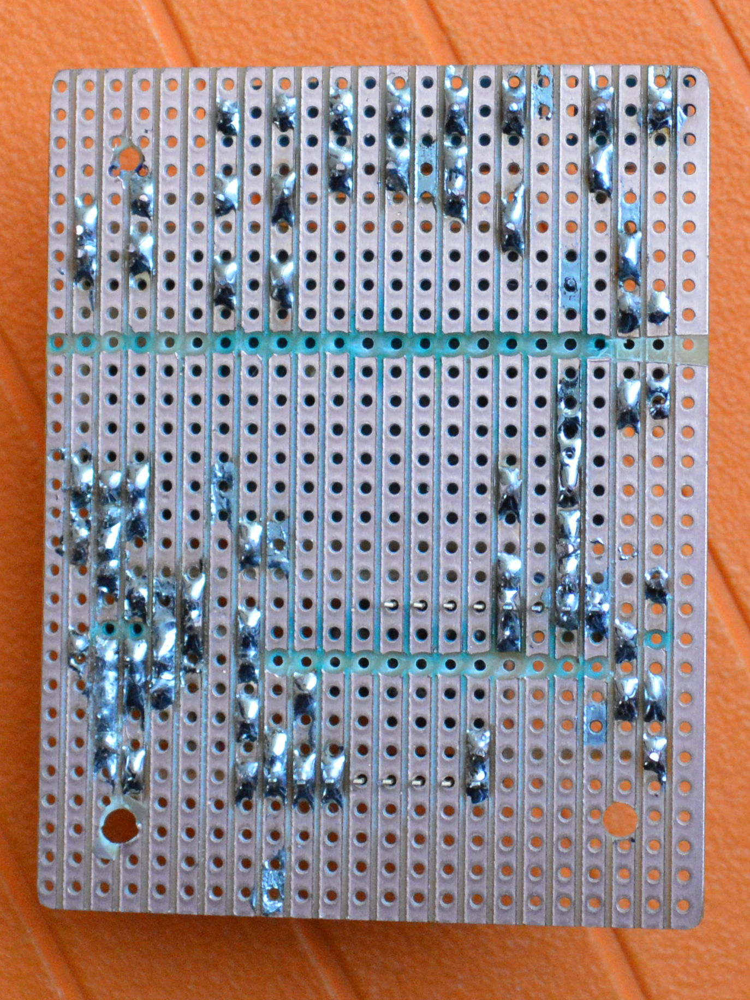

## Projet

Commander un relai bistable qui doit commuter du 240 V avec une tension de commande de 9V très instable. Pour limiter les effets de l’instabilité de la tension de commande, le système doit être temporisé, c’est-à-dire que dès que la première impulsion de commande est détectée, le relai doit s’ouvrir et rester ouvert pendant un temps défini, même si la tension de commande disparait. La détection de la commande 9 V et la temporisation sont réalisées avec un Arduino Pro Mini (ATmega 328p, 3.3V, 8MHz interne).

Cette commande à relai est utilisée pour alimenter un lit électrique avec commande 9 V dans les mains de l’utilisateur. L’idée est d’amener le 240 V jusqu’au lit uniquement quand l’utilisateur actionne les moteurs. Ainsi il ne passe pas ses nuits avec du 240 V dans le dos.

## Matériel

- [Alimentation Mean Well, IRM-03-3.3, 3.3V, PCB](https://www.distrelec.ch/fr/bloc-alimentation-decoupage-sortie-mean-well-irm-03/p/30051638)
  - [Spécifications (PDF)](../../files/2017-04-14-relai-bistable-commande-tension/datasheets/irm03_eng_tds.pdf)
- [Relais de puissance pour circuits imprimés 3 VDC 400 mW, ADW1203W, Panasonic](https://www.distrelec.ch/fr/relais-de-puissance-pour-circuits-imprimes-vdc-400-mw-panasonic-adw1203w/p/11030041)
  - [Spécifications (PDF)](../../files/2017-04-14-relai-bistable-commande-tension/datasheets/adw1_eng_tds.pdf)
- [Transistor NPN BC337, Spécifications (PDF)](../../files/2017-04-14-relai-bistable-commande-tension/datasheets/BC337-D.PDF)
- [Veroboard, Carte de laboratoire Papier bakélisé au phénol FR2, 710-2, Rademacher](https://www.distrelec.ch/fr/carte-de-laboratoire-papier-bakelise-au-phenol-fr2-rademacher-710/p/14832982)
- [Diode 1N4004 400 V 1A DO-41](https://fr.aliexpress.com/item/50pcs-1N4004-400V-1A-DO-41-Axial-Lead-Silicon-Rectifier-Diodes/32464825368.html)
- [Optocoupleur SFH620A DIP DIP-4](https://fr.aliexpress.com/item/Free-shippin-10pcs-lot-SFH620A-DIP-DIP-4-new-original/32553455903.html?spm=2114.13010608.0.0.H1VvjL)
  - [Spécifications (PDF)](../../files/2017-04-14-relai-bistable-commande-tension/datasheets/sfh620.pdf)
- [Relai solid state (pour le tout premier proto)](https://fr.aliexpress.com/item/Industrial-FOTEK-single-phase-solid-state-relay-SSR-25DA-25A-actually-3-32V-DC-TO-24/32621331021.html)
- [Boitier plastique](https://fr.aliexpress.com/item/Two-colors-plastic-enclosure-diy-project-box-abs-plastic-box-electronics-small-desktop-box-135/32426076659.html)
  - [Boitier plastique dimensions 1](../../files/2017-04-14-relai-bistable-commande-tension/schemas/dimension-boitier-plastique-1.jpg)
  - [Boitier plastique dimensions 2](../../files/2017-04-14-relai-bistable-commande-tension/schemas/dimension-boitier-plastique-2.jpg)
  - [Onshape 1](https://cad.onshape.com/documents/bdfa03cae61f8d99e05c256d/w/6a80dbc21d7d7ec99d4ca430/e/ff237b71c3e3937e7775091c)
  - [Onshape 2](https://cad.onshape.com/documents/bdfa03cae61f8d99e05c256d/w/6a80dbc21d7d7ec99d4ca430/e/d16ebce6912d78151dce1e60)
- [Presse-étoupes](https://fr.aliexpress.com/item/PG7-Cable-Glands-Nylon-plastic-waterproof-cable-connectors-spiral-fixed-2013-New-product/1000045565.html)
- [Forêts à étage (pour la découpe des passages des presse-étoupes)](https://fr.aliexpress.com/item/3pcs-HSS-Steel-Step-Cone-Milling-Cutter-Titanium-Coated-Step-Drill-Cutting-Tools-Bit-Set/32661376446.html)
- [Arduino Pro Mini](http://www.banggood.com/5Pcs-3_3V-8MHz-ATmega328P-AU-Pro-Mini-Microcontroller-Board-For-Arduino-p-980292.html?p=0431091025639201412F)
- [Interface clone FTDI (je déconseille ce modèle car il envoie du 5 V en mode 3.3 V, mais pour l’Arduino Pro Mini, ça n’a pas de conséquence)](http://www.miniinthebox.com/fr/programme-downloader-ftdi-basic-usb-a-ttl-ft232-pour-arduino_p903425.html)

## Programme

<https://github.com/NicHub/ouilogique-Arduino/blob/master/relai-bistable-commande-tension/relai-bistable-commande-tension.ino>

Pour la programmation de l’Arduino Pro Mini dans l’IDE Arduino, voir <http://ouilogique.com/arduino-pro-mini/>

## Prototype sur *breadboard*

## Prototype sur *veroboard*

## Tout premier prototype

Le tout premier prototype était basé sur un Arduino UNO avec deux relais solid state, un pour la phase et l’autre pour le neutre. J’ai préféré la solution avec relai bistable pour le deuxième proto (ci-dessus), pour assurer la séparation galvanique. Le relai bistable a aussi l’avantage de ne consommer que lors des commutations.

